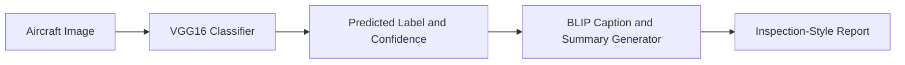

# Aircraft Damage Classification and Automated Report Generation using VGG16 and BLIP

[](https://github.com/ezedeem223/aircraft_damage_vgg16_blip/actions/workflows/ci.yml)

This repository combines two related tasks for aircraft inspection support:

1. binary image classification of aircraft surface damage using a VGG16-based transfer learning model
2. automated captioning and report-style text generation using BLIP

The original project was built as a notebook-driven experiment. This refactor preserves that workflow and model choice while reorganizing the code into a reproducible Python package, runnable scripts, structured results, lightweight tests, and a simple demo interface.

## Quick Start

The fastest path to try the full pipeline locally is:

```bash
python -m venv .venv
.\.venv\Scripts\Activate.ps1
# or: source .venv/bin/activate
python -m pip install --upgrade pip
python -m pip install -r requirements.txt
python -m pip install -e .

# if you do not already have a local checkpoint
python scripts/run_train.py --config configs/train.yaml --download-data

# launch the demo once a checkpoint is available
python scripts/run_demo.py --config configs/inference.yaml --report-config configs/report_generation.yaml
```

If you already have `models/vgg16_aircraft_damage.keras`, you can skip training and go straight to `scripts/run_demo.py` or `scripts/run_predict.py`.

## Why This Project Matters

Aircraft inspection workflows often need more than a single label. This project combines binary damage classification with descriptive BLIP text so one image can produce both a categorical signal and readable inspection context, which is useful for maintenance triage, documentation support, and reducing repetitive manual review steps.

## Key Features

- VGG16 transfer-learning pipeline for binary aircraft damage classification
- BLIP-backed caption and summary generation wrapped in a clean reporting interface
- Config-driven training, evaluation, prediction, and demo scripts
- Structured `results/` directory for metrics, plots, sample predictions, and sample reports
- Preserved original notebook plus a slimmer exploration notebook that calls package code
- Graceful setup errors when data, checkpoints, or BLIP assets are missing


*Preserved notebook output from the original project showing a sample aircraft-damage prediction result.*

## Architecture Diagram



## Project Structure

```text
aircraft_damage_vgg16_blip/
├── .env.example
├── .github/
│   └── workflows/
│       └── ci.yml
├── .gitignore
├── LICENSE
├── Makefile
├── README.md
├── app/
│   ├── __init__.py
│   └── gradio_app.py
├── configs/
│   ├── inference.yaml
│   ├── report_generation.yaml
│   └── train.yaml
├── data/
│   └── README.md
├── models/
│   └── README.md
├── notebooks/
│   ├── aircraft_damage_vgg16_blip.ipynb
│   └── exploration.ipynb
├── pyproject.toml
├── requirements-dev.txt
├── requirements.txt
├── results/
│   ├── README.md
│   ├── accuracy_curve.png
│   ├── classification_report.txt
│   ├── confusion_matrix.png
│   ├── metrics.json
│   ├── sample_predictions/
│   │   └── notebook_sample_prediction.png
│   ├── sample_reports/
│   │   ├── notebook_blip_example_image.png
│   │   └── notebook_blip_outputs.txt
│   ├── training_loss.png
│   └── validation_loss.png
├── scripts/
│   ├── run_demo.py
│   ├── run_evaluate.py
│   ├── run_predict.py
│   └── run_train.py
├── src/
│   └── aircraft_damage/
│       ├── __init__.py
│       ├── config.py
│       ├── dataset.py
│       ├── evaluate.py
│       ├── predict.py
│       ├── preprocessing.py
│       ├── report_generator.py
│       ├── train.py
│       ├── utils.py
│       └── visualization.py
└── tests/
    ├── test_config.py
    ├── test_predict.py
    └── test_report_generator.py
```

## Problem and Approach

Aircraft maintenance images often need both a coarse damage label and descriptive context. This project keeps that split explicit:

- The classifier predicts the damage category from an image using a frozen ImageNet-pretrained VGG16 backbone with a small dense head.
- The report generator uses BLIP to produce image-aware natural language text.
- The final output combines the classifier result and BLIP text into a simple inspection-style report.

This setup is intentionally practical rather than overengineered: classification provides a fast categorical signal, while BLIP adds human-readable context that is useful for demos, portfolio presentation, and inspection assistance workflows.

## Dataset

The original notebook used the public aircraft damage dataset mirrored at:

- Course mirror: `https://cf-courses-data.s3.us.cloud-object-storage.appdomain.cloud/ZjXM4RKxlBK9__ZjHBLl5A/aircraft-damage-dataset-v1.tar`
- Original source reference: Roboflow Aircraft Damage Dataset by Youssef Donia
- Data license reference in the original project: CC BY 4.0

The dataset is not committed to this repository. Place it locally under:

```text
data/aircraft_damage_dataset_v1/
├── train/
│   ├── crack/
│   └── dent/
├── valid/
│   ├── crack/
│   └── dent/
└── test/
    ├── crack/
    └── dent/
```

You can either:

- extract the dataset manually into `data/aircraft_damage_dataset_v1/`
- or let the training script fetch the public tarball with `--download-data`

More detail is in [data/README.md](data/README.md).

## Methodology

### 1. Classifier

- Backbone: VGG16 pretrained on ImageNet with `include_top=False`
- Classifier head:
  - Flatten
  - Dense(512, ReLU)
  - Dropout(0.3)
  - Dense(512, ReLU)
  - Dropout(0.3)
  - Dense(1, Sigmoid)
- Training setup preserved from the original notebook:
  - image size: `224 x 224`
  - batch size: `32`
  - epochs: `5`
  - optimizer: Adam with `1e-4`
  - loss: binary cross-entropy

### 2. Report Generation

- Model family: BLIP image captioning
- Default model id: `Salesforce/blip-image-captioning-base`
- Wrapped in `src/aircraft_damage/report_generator.py`
- Produces:
  - a short caption
  - a longer descriptive summary
  - a consolidated text report that includes classifier output and generation status

### 3. End-to-End Pipeline

1. load and preprocess the image
2. run VGG16 damage classification
3. compute predicted class and confidence
4. run BLIP caption and summary generation
5. return a structured inspection-style report

## Results

This repository preserves the actual baseline metrics visible in the original notebook output. They are stored in [results/metrics.json](results/metrics.json) and summarized here:

- Training samples: `300`
- Validation samples: `96`
- Test samples: `50`
- Final training accuracy after 5 epochs: `0.8800`
- Final validation accuracy after 5 epochs: `0.7083`
- Test accuracy: `0.6875`
- Test loss: `0.7326`

Important:

- These numbers come from the committed notebook output, not from a re-run during this refactor.
- The trained checkpoint used to produce them is not included in the repository.
- A full classification report and confusion matrix were not saved in the original notebook, so placeholders are included until you run evaluation with a local checkpoint.

To generate fresh evaluation artifacts once you have data and a checkpoint:

```bash
python scripts/run_evaluate.py --config configs/inference.yaml
```

## Sample Outputs

### Preserved notebook outputs

- Sample prediction visualization: [results/sample_predictions/notebook_sample_prediction.png](results/sample_predictions/notebook_sample_prediction.png)
- BLIP example image: [results/sample_reports/notebook_blip_example_image.png](results/sample_reports/notebook_blip_example_image.png)
- BLIP text outputs: [results/sample_reports/notebook_blip_outputs.txt](results/sample_reports/notebook_blip_outputs.txt)

Example BLIP outputs preserved from the notebook:

```text
Caption: this is a picture of a plane
Summary: this is a detailed photo showing the engine of a boeing 747

Caption: this is a picture of a plane that was sitting on the ground in a field
Summary: this is a detailed photo showing the damage to the fuselage of the aircraft
```

### Example End-to-End Output

The preserved notebook artifacts show the two halves of the workflow separately: a classification visualization and BLIP-generated text. In the packaged project, those pieces are combined into one inspection-style output.

- Classification signal preserved in the notebook sample image: predicted label `crack`
- Confidence is available in the current CLI and demo flow, but it was not logged in the original notebook artifacts
- BLIP descriptive signal preserved in the notebook outputs includes `Caption: this is a picture of a plane`
- BLIP descriptive signal preserved in the notebook outputs includes `Summary: this is a detailed photo showing the engine of a boeing 747`
- BLIP descriptive signal preserved in the notebook outputs includes `Caption: this is a picture of a plane that was sitting on the ground in a field`
- BLIP descriptive signal preserved in the notebook outputs includes `Summary: this is a detailed photo showing the damage to the fuselage of the aircraft`

Current report-style output structure in the refactored package:

```text
Aircraft Damage Assessment
Image: <image_name>
Predicted damage class: <class_name>
Confidence: <confidence>
Caption: <caption or fallback>
Summary: <summary or fallback>
Metadata:
- No additional metadata supplied.
Generation status: <BLIP status>
Note: This output is decision support only and should be reviewed by a human inspector.
```

The structure above reflects the current code path in `scripts/run_predict.py` and `src/aircraft_damage/report_generator.py`. Exact class labels, confidence values, and report text still depend on the local checkpoint and runtime inputs.

## Installation

Use Python `3.10+`.

```bash
python -m venv .venv
.\.venv\Scripts\Activate.ps1
# or: source .venv/bin/activate
python -m pip install --upgrade pip
python -m pip install -r requirements.txt
python -m pip install -e .
```

For development tooling:

```bash
python -m pip install -r requirements-dev.txt
```

Optional environment variables are listed in [.env.example](.env.example).

## Usage

### Train

```bash
python scripts/run_train.py --config configs/train.yaml --download-data
```

### Evaluate

```bash
python scripts/run_evaluate.py --config configs/inference.yaml
```

### Predict

```bash
python scripts/run_predict.py --image path/to/image.jpg --config configs/inference.yaml --report-config configs/report_generation.yaml
```

### Launch the demo

```bash
python scripts/run_demo.py --config configs/inference.yaml --report-config configs/report_generation.yaml
```

## Notebook Workflow

- [notebooks/aircraft_damage_vgg16_blip.ipynb](notebooks/aircraft_damage_vgg16_blip.ipynb) preserves the original end-to-end notebook implementation and outputs.
- [notebooks/exploration.ipynb](notebooks/exploration.ipynb) is a slimmer notebook intended for exploration and demos using the refactored package.

The repository no longer depends on the notebook for core functionality.

## Limitations

- The current classifier is binary only and assumes the `crack` vs `dent` setup from the original notebook.
- No fine-tuned checkpoint is committed, so prediction, evaluation, and demo flows require local training or a user-supplied checkpoint.
- The BLIP model downloads from Hugging Face the first time it is used unless cached locally.
- The current pipeline classifies the whole image and does not localize damage regions.
- The generated report is descriptive support text, not a certified maintenance document.

## Future Work

- Add damage severity estimation
- Add localization or segmentation for damaged regions
- Extend from binary to multi-label or multi-class damage categories
- Compare VGG16 against stronger modern backbones
- Improve report generation with domain-specific prompts or fine-tuning

## License

This repository is released under the MIT License for code. Dataset usage remains subject to the upstream dataset license and terms described in the data source.
