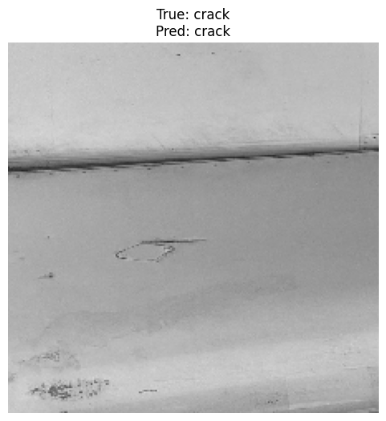
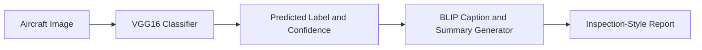

# Aircraft Damage Classification and Automated Report Generation using VGG16 and BLIP

[](https://github.com/ezedeem223/aircraft_damage_vgg16_blip/actions/workflows/ci.yml)

This repository packages an aircraft inspection-support workflow built around two
cooperating tasks:

1. binary image classification of aircraft surface damage using a VGG16-based transfer learning model
2. automated captioning and report-style text generation using BLIP

The maintained surface is the `aircraft_damage` Python package, its
config-driven scripts, and a lightweight demo interface. Archived notebooks
remain for provenance and exploration, but they do not define the maintained
runtime surface or release identity.

## Quick Start

The fastest path to run the maintained inspection-support workflow locally is:

```bash
python -m venv .venv
.\.venv\Scripts\Activate.ps1
# or: source .venv/bin/activate
python -m pip install --upgrade pip
python -m pip install -r requirements.txt
python -m pip install -e .

# if you do not already have a local checkpoint
python scripts/run_train.py --config configs/train.yaml --download-data

# launch the demo once a checkpoint is available
python scripts/run_demo.py --config configs/inference.yaml --report-config configs/report_generation.yaml
```

If you already have `models/vgg16_aircraft_damage.keras`, you can skip training
and go straight to `scripts/run_demo.py` or `scripts/run_predict.py`.

## Python API

The package can also be used directly from Python:

```python
from aircraft_damage import generate_damage_report, load_config, predict_image

config = load_config("configs/inference.yaml")
prediction = predict_image(
    image_path="path/to/image.jpg",
    checkpoint_path=config["paths"]["model_checkpoint"],
    class_names=config["classifier"]["class_names"],
    image_size=tuple(config["classifier"]["image_size"]),
    threshold=float(config["classifier"]["threshold"]),
)

report = generate_damage_report(
    image_path=prediction.image_path,
    predicted_class=prediction.predicted_class,
    confidence=prediction.confidence,
)
```

This uses the exported package surface directly. It still requires a local
classifier checkpoint and may download BLIP assets on first use.

## Why This Project Matters

Aircraft inspection workflows often need more than a single label. This project combines binary damage classification with descriptive BLIP text so one image can produce both a categorical signal and readable inspection context, which is useful for maintenance triage, documentation support, and reducing repetitive manual review steps.

## Key Features

- VGG16 transfer-learning pipeline for binary aircraft damage classification
- BLIP-backed caption and summary generation wrapped in a clean reporting interface
- Installable Python package plus config-driven training, evaluation, prediction,
  and demo scripts
- Structured `results/` directory for metrics, plots, sample predictions, and sample reports
- Archived notebooks retained for provenance and exploration without defining the
  maintained runtime surface
- Graceful setup errors when data, checkpoints, or BLIP assets are missing



*Archived experiment output showing a sample aircraft-damage prediction result.*

## Architecture Diagram



## Project Structure

```text
aircraft_damage_vgg16_blip/
|-- .env.example
|-- .gitattributes
|-- .github/
|   `-- workflows/
|       `-- ci.yml
|-- .gitignore
|-- CITATION.cff
|-- LICENSE
|-- Makefile
|-- README.md
|-- app/
|   |-- __init__.py
|   `-- gradio_app.py
|-- configs/
|   |-- inference.yaml
|   |-- report_generation.yaml
|   `-- train.yaml
|-- data/
|   `-- README.md
|-- models/
|   `-- README.md
|-- pyproject.toml
|-- requirements-dev.txt
|-- requirements.txt
|-- results/
|   |-- README.md
|   |-- accuracy_curve.png
|   |-- classification_report.txt
|   |-- confusion_matrix.png
|   |-- metrics.json
|   |-- sample_predictions/
|   |   `-- notebook_sample_prediction.png
|   |-- sample_reports/
|   |   |-- notebook_blip_example_image.png
|   |   `-- notebook_blip_outputs.txt
|   |-- training_loss.png
|   `-- validation_loss.png
|-- scripts/
|   |-- run_demo.py
|   |-- run_evaluate.py
|   |-- run_predict.py
|   `-- run_train.py
|-- src/
|   `-- aircraft_damage/
|       |-- __init__.py
|       |-- config.py
|       |-- dataset.py
|       |-- evaluate.py
|       |-- predict.py
|       |-- preprocessing.py
|       |-- report_generator.py
|       |-- train.py
|       |-- utils.py
|       `-- visualization.py
|-- notebooks/
|   |-- README.md
|   |-- aircraft_damage_vgg16_blip.ipynb
|   `-- exploration.ipynb
`-- tests/
    |-- test_config.py
    |-- test_predict.py
    `-- test_report_generator.py
```

## Problem and Approach

Aircraft maintenance images often need both a coarse damage label and descriptive context. This project keeps that split explicit:

- The classifier predicts the damage category from an image using a frozen ImageNet-pretrained VGG16 backbone with a small dense head.
- The report generator uses BLIP to produce image-aware natural language text.
- The final output combines the classifier result and BLIP text into a simple inspection-style report.

This setup is intentionally practical rather than overengineered: classification provides a fast categorical signal, while BLIP adds human-readable context that is useful for demos, portfolio presentation, and inspection assistance workflows.

## Dataset

This project uses a public aircraft damage dataset referenced below:

- Public dataset tarball reference used by the current project configuration:
  `https://cf-courses-data.s3.us.cloud-object-storage.appdomain.cloud/ZjXM4RKxlBK9__ZjHBLl5A/aircraft-damage-dataset-v1.tar`
- Original source reference: Roboflow Aircraft Damage Dataset by Youssef Donia
- Public source license reference: CC BY 4.0

The dataset is not committed to this repository. Place it locally under:

```text
data/aircraft_damage_dataset_v1/
|-- train/
|   |-- crack/
|   `-- dent/
|-- valid/
|   |-- crack/
|   `-- dent/
`-- test/
    |-- crack/
    `-- dent/
```

You can either:

- extract the dataset manually into `data/aircraft_damage_dataset_v1/`
- or let the training script fetch the public tarball with `--download-data`

More detail is in [data/README.md](data/README.md).

## Methodology

### 1. Classifier

- Backbone: VGG16 pretrained on ImageNet with `include_top=False`
- Classifier head:
  - Flatten
  - Dense(512, ReLU)
  - Dropout(0.3)
  - Dense(512, ReLU)
  - Dropout(0.3)
  - Dense(1, Sigmoid)
- Baseline training configuration used for the recorded experiment artifacts:
  - image size: `224 x 224`
  - batch size: `32`
  - epochs: `5`
  - optimizer: Adam with `1e-4`
  - loss: binary cross-entropy

### 2. Report Generation

- Model family: BLIP image captioning
- Default model id: `Salesforce/blip-image-captioning-base`
- Wrapped in `src/aircraft_damage/report_generator.py`
- Produces:
  - a short caption
  - a longer descriptive summary
  - a consolidated text report that includes classifier output and generation status

### 3. End-to-End Pipeline

1. load and preprocess the image
2. run VGG16 damage classification
3. compute predicted class and confidence
4. run BLIP caption and summary generation
5. return a structured inspection-style report

## Results

This repository includes baseline metrics from archived experiment artifacts.
The maintained runtime surface is the Python package, scripts, and demo, while
these preserved outputs provide provenance for the reported baseline. The
metrics are stored in [results/metrics.json](results/metrics.json) and
summarized here:

- Training samples: `300`
- Validation samples: `96`
- Test samples: `50`
- Final training accuracy after 5 epochs: `0.8800`
- Final validation accuracy after 5 epochs: `0.7083`
- Test accuracy: `0.6875`
- Test loss: `0.7326`

Important:

- These numbers come from committed experiment artifacts and are not newly generated in this documentation pass.
- The trained checkpoint used to produce them is not included in the repository.
- A full classification report and confusion matrix were not saved with the archived experiment artifacts, so placeholders are included until you run evaluation with a local checkpoint.

To generate fresh evaluation artifacts once you have data and a checkpoint:

```bash
python scripts/run_evaluate.py --config configs/inference.yaml
```

## Sample Outputs

### Archived experiment outputs

- Sample prediction visualization: [results/sample_predictions/notebook_sample_prediction.png](results/sample_predictions/notebook_sample_prediction.png)
- BLIP example image: [results/sample_reports/notebook_blip_example_image.png](results/sample_reports/notebook_blip_example_image.png)
- BLIP text outputs: [results/sample_reports/notebook_blip_outputs.txt](results/sample_reports/notebook_blip_outputs.txt)

Example BLIP outputs captured in the archived experiment artifacts:

```text
Caption: this is a picture of a plane
Summary: this is a detailed photo showing the engine of a boeing 747

Caption: this is a picture of a plane that was sitting on the ground in a field
Summary: this is a detailed photo showing the damage to the fuselage of the aircraft
```

### Example End-to-End Output

The archived experiment artifacts show the two halves of the workflow separately: a classification visualization and BLIP-generated text. In the current project, those pieces are combined into one inspection-style output.

- Classification signal captured in the archived sample image: predicted label `crack`
- Confidence is available in the current CLI and demo flow, but it was not logged in the archived experiment artifacts
- BLIP descriptive signal preserved in the archived outputs includes `Caption: this is a picture of a plane`
- BLIP descriptive signal preserved in the archived outputs includes `Summary: this is a detailed photo showing the engine of a boeing 747`
- BLIP descriptive signal preserved in the archived outputs includes `Caption: this is a picture of a plane that was sitting on the ground in a field`
- BLIP descriptive signal preserved in the archived outputs includes `Summary: this is a detailed photo showing the damage to the fuselage of the aircraft`

Current report-style output structure in the packaged project:

```text
Aircraft Damage Assessment
Image: <image_name>
Predicted damage class: <class_name>
Confidence: <confidence>
Caption: <caption or fallback>
Summary: <summary or fallback>
Metadata:
- No additional metadata supplied.
Generation status: <BLIP status>
Note: This output is decision support only and should be reviewed by a human inspector.
```

The structure above reflects the current code path in `scripts/run_predict.py` and `src/aircraft_damage/report_generator.py`. Exact class labels, confidence values, and report text still depend on the local checkpoint and runtime inputs.

## Installation

Use Python `3.10+`.

```bash
python -m venv .venv
.\.venv\Scripts\Activate.ps1
# or: source .venv/bin/activate
python -m pip install --upgrade pip
python -m pip install -r requirements.txt
python -m pip install -e .
```

For development tooling:

```bash
python -m pip install -r requirements-dev.txt
```

Optional environment variables are listed in [.env.example](.env.example).

## Usage

### Train

```bash
python scripts/run_train.py --config configs/train.yaml --download-data
```

### Evaluate

```bash
python scripts/run_evaluate.py --config configs/inference.yaml
```

### Predict

```bash
python scripts/run_predict.py --image path/to/image.jpg --config configs/inference.yaml --report-config configs/report_generation.yaml
```

### Launch the demo

```bash
python scripts/run_demo.py --config configs/inference.yaml --report-config configs/report_generation.yaml
```

## Archived Notebooks

- [notebooks/aircraft_damage_vgg16_blip.ipynb](notebooks/aircraft_damage_vgg16_blip.ipynb) is an archived development notebook containing the earlier exploratory implementation and recorded outputs.
- [notebooks/exploration.ipynb](notebooks/exploration.ipynb) is a curated lightweight notebook for exploration and demos against the packaged codebase.

The repository no longer depends on notebook execution for core functionality.
See [notebooks/README.md](notebooks/README.md) for the provenance and Linguist
note that applies to this archived material.

## Limitations

- The current classifier is binary only and assumes the `crack` vs `dent` label setup used by the archived experiment assets and current configs.
- No fine-tuned checkpoint is committed, so prediction, evaluation, and demo flows require local training or a user-supplied checkpoint.
- The BLIP model downloads from Hugging Face the first time it is used unless cached locally.
- The current pipeline classifies the whole image and does not localize damage regions.
- The generated report is descriptive support text, not a certified maintenance document.

## Future Work

- Add damage severity estimation
- Add localization or segmentation for damaged regions
- Extend from binary to multi-label or multi-class damage categories
- Compare VGG16 against stronger modern backbones
- Improve report generation with domain-specific prompts or fine-tuning

## License

Code in this repository is released under the [MIT License](LICENSE). Dataset
usage remains subject to the upstream dataset license and terms described in the
data source.
